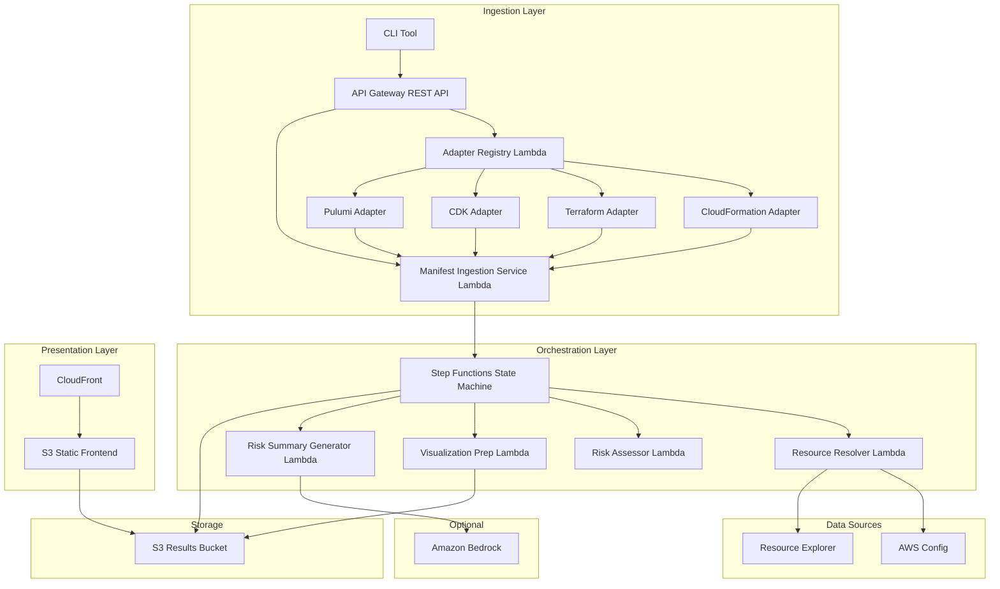
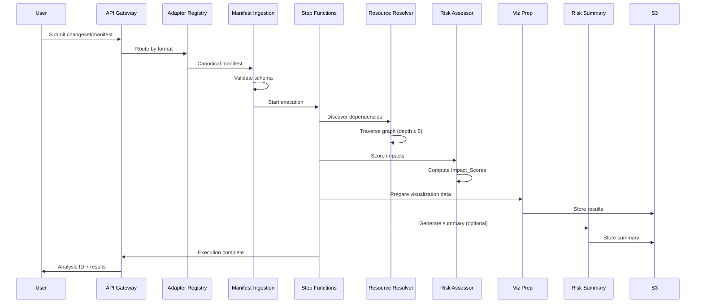
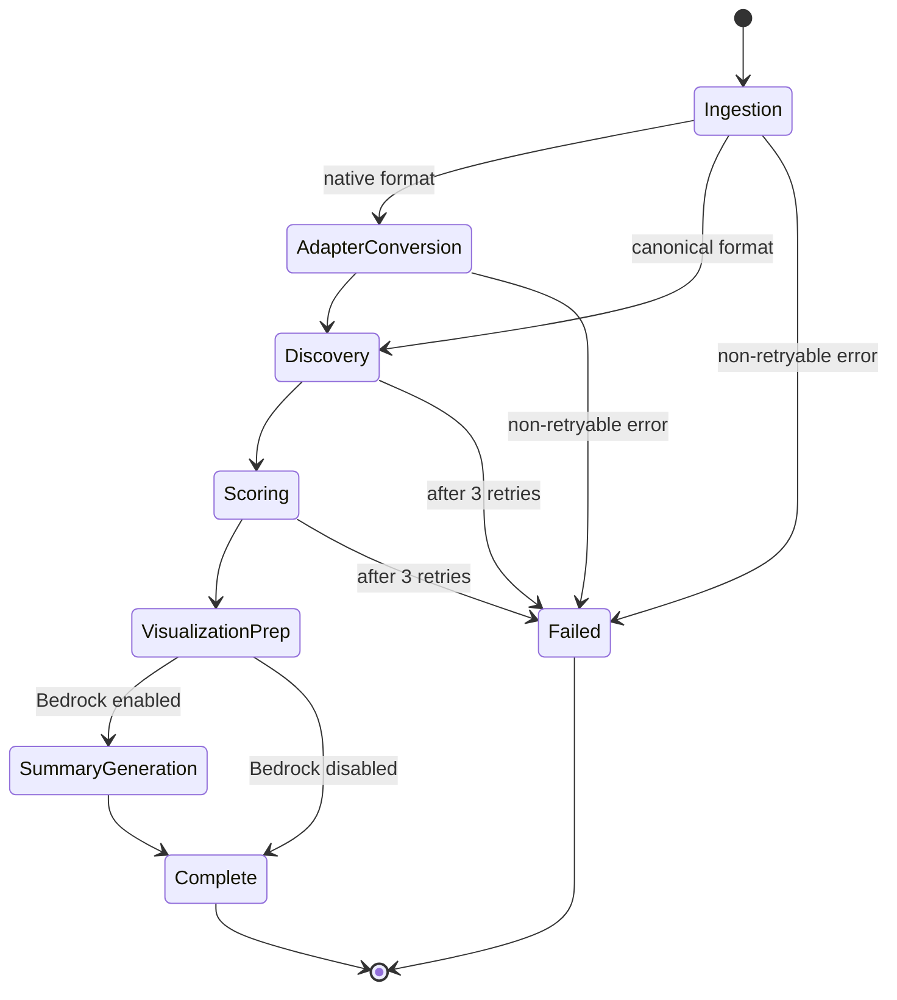

# Design Document: Blast Radius Pre-Deploy Visualizer

## Overview

The Blast Radius Pre-Deploy Visualizer is a serverless system that analyzes infrastructure-as-code changesets before deployment to identify, score, and visualize downstream resource dependencies at risk. The system is IaC-tool-agnostic: it defines a canonical Resource Change Manifest format and uses adapter plugins to convert native changeset formats (CloudFormation, CDK, Terraform, Pulumi) into the canonical format. The core analysis engine operates exclusively on the canonical format.

The architecture follows an event-driven, pipeline-based design orchestrated by AWS Step Functions. Lambda functions perform discrete analysis tasks (manifest validation, dependency discovery, risk scoring). AWS Config and Resource Explorer provide resource relationship data. Results are stored in S3 and served through a CloudFront-hosted React frontend. Optionally, Amazon Bedrock generates natural language risk summaries.

Key design decisions:
- **Canonical manifest format**: Decouples IaC tool specifics from analysis logic, enabling new tool support via adapter plugins only.
- **Step Functions orchestration**: Provides built-in retry, error handling, observability, and stage-level progress tracking.
- **Serverless compute**: Lambda functions scale to zero and handle burst workloads without provisioning.
- **AWS Config + Resource Explorer**: Leverages existing AWS-managed relationship data rather than building a custom CMDB.

## Architecture



### Workflow Sequence



## Components and Interfaces

### 1. API Gateway (REST API)

**Responsibility**: Entry point for all analysis requests. Handles authentication (SigV4), request routing, and status polling.

**Endpoints**:
| Method | Path | Description |
|--------|------|-------------|
| POST | `/analyze` | Submit a manifest or native changeset for analysis |
| GET | `/analyze/{analysisId}` | Get analysis status and results |
| GET | `/analyze/{analysisId}/export` | Export results as JSON or PDF |
| GET | `/formats` | List supported adapter formats |

**Request schema for POST /analyze**:
```json
{
  "format": "canonical | cloudformation | terraform-plan | cdk | pulumi",
  "manifest": { ... },
  "options": {
    "maxDepth": 5,
    "riskThreshold": 75,
    "enableSummary": true
  }
}
```

**Authentication**: All endpoints require SigV4 signatures. The requesting principal's IAM ARN is extracted and used for access scoping.

### 2. Adapter Registry Lambda

**Responsibility**: Routes incoming changesets to the appropriate Manifest Adapter based on the declared `format` field. Maintains a registry of available adapters.

**Interface**:
```typescript
interface AdapterRegistryInput {
  format: string;
  payload: unknown;
}

interface AdapterRegistryOutput {
  manifest: ResourceChangeManifest;
  adapterMetadata: {
    adapterName: string;
    conversionDurationMs: number;
    warnings: string[];
  };
}
```

**Plugin mechanism**: Adapters are registered as Lambda function ARNs in a DynamoDB configuration table. New adapters are added by inserting a row — no code changes to the registry or core engine.

### 3. Manifest Adapters (CloudFormation, Terraform, CDK, Pulumi)

**Responsibility**: Each adapter converts a native changeset format into a valid `ResourceChangeManifest`.

**Interface** (each adapter implements):
```typescript
interface ManifestAdapter {
  convert(nativeChangeset: unknown): ResourceChangeManifest;
  supportedFormat(): string;
}
```

**Design decisions**:
- Each adapter is a separate Lambda function for independent deployment and scaling.
- Adapters validate their own input format before conversion.
- Adapters produce a manifest that must pass canonical schema validation downstream.

### 4. Manifest Ingestion Service Lambda

**Responsibility**: Validates incoming `ResourceChangeManifest` documents against the canonical JSON Schema. Flattens hierarchical groupings. Enforces size and depth limits.

**Interface**:
```typescript
interface IngestionInput {
  manifest: ResourceChangeManifest;
  requestingPrincipal: string;
  sourceFormat: string;
}

interface IngestionOutput {
  analysisId: string;
  validatedManifest: ResourceChangeManifest; // flattened
  resourceCount: number;
}
```

**Validation rules**:
- JSON Schema validation (resource type, identifier, provider, modification type required)
- Max 200 resource modifications
- Max 10 MB payload size
- Max 10 levels nesting depth for hierarchical groups
- Atomic validation: entire manifest rejected on any single resource failure

### 5. Analysis Pipeline (Step Functions State Machine)

**Responsibility**: Orchestrates the end-to-end analysis workflow with retry logic, error handling, and progress tracking.

**States**:


**Retry policy**: Retryable errors (service throttling, transient network) retry up to 3 times with exponential backoff (2s, 4s, 8s, capped at 30s). Non-retryable errors (invalid input, permission denied, resource not found) fail immediately.

**Progress tracking**: Each state updates a DynamoDB status record with stage name, progress percentage, and elapsed time.

### 6. Resource Resolver Lambda

**Responsibility**: Discovers resource dependencies by querying AWS Config relationship data and Resource Explorer. Traverses the dependency graph recursively.

**Interface**:
```typescript
interface ResolverInput {
  resources: ResourceChange[];
  maxDepth: number;
  requestingPrincipal: string;
}

interface ResolverOutput {
  dependencyGraph: DependencyGraph;
  coverage: CoverageReport;
  cacheStats: { hits: number; misses: number; };
}
```

**Design decisions**:
- Uses AWS Config Advanced Queries with `relationships.resourceId` to find direct dependencies.
- Uses Resource Explorer multi-account search for cross-account/cross-region discovery.
- Maintains an in-memory LRU cache (up to 10,000 entries) within the execution to avoid redundant API calls.
- Detects circular references via a visited-set during traversal.
- Marks resources with partial or unknown coverage when AWS Config/Resource Explorer data is incomplete.
- Scopes queries to accounts/regions the requesting principal has read access to.

### 7. Risk Assessor Lambda

**Responsibility**: Computes Impact_Score for each affected resource and classifies into risk categories.

**Interface**:
```typescript
interface AssessorInput {
  dependencyGraph: DependencyGraph;
  manifest: ResourceChangeManifest;
}

interface AssessorOutput {
  scoredResources: ScoredResource[];
  riskSummary: {
    critical: number;
    high: number;
    medium: number;
    low: number;
    totalAffected: number;
    highestScore: number;
  };
}
```

**Scoring formula**:
```
Impact_Score = (depthScore * 0.30) + (criticalityScore * 0.40) + (changeTypeSeverity * 0.30)

where:
  depthScore = max(10, 100 - ((depth - 1) * 10))  // depth 1 = 100, depth 10 = 10
  criticalityScore = { Critical: 100, High: 75, Medium: 50, Low: 25 }
  changeTypeSeverity = { Remove: 100, Replace: 80, Modify: 50 }
```

**Multi-path handling**: When a resource has multiple dependency paths, the path yielding the highest Impact_Score is used.

### 8. Visualization Prep Lambda

**Responsibility**: Transforms the scored dependency graph into a format optimized for frontend rendering (node/edge lists with layout hints).

### 9. Risk Summary Generator Lambda (Optional)

**Responsibility**: Invokes Amazon Bedrock to generate a natural language summary of the blast radius analysis.

**Interface**:
```typescript
interface SummaryInput {
  scoredResources: ScoredResource[];
  riskSummary: RiskSummary;
  dependencyGraph: DependencyGraph;
}

interface SummaryOutput {
  summary: string; // max 500 words
  generationDurationMs: number;
}
```

**Design decisions**:
- Uses Amazon Bedrock InvokeModel API with a structured prompt.
- Timeout: 15 seconds. On failure, analysis results are still available without the summary.
- Feature flag controls enablement — when disabled, this Lambda is not invoked.

### 10. Visualization Frontend (S3 + CloudFront)

**Responsibility**: Interactive web application for exploring blast radius results.

**Technology**: React SPA with a graph visualization library (e.g., D3.js or Cytoscape.js) for rendering dependency graphs.

**Features**:
- Interactive graph with zoom, pan, node selection
- Color-coded nodes by risk category
- Filter by risk category, resource type, source IaC tool
- Tabular summary view sorted by Impact_Score
- PDF and JSON export
- Status polling during analysis execution

### 11. CLI Tool

**Responsibility**: Command-line wrapper around the REST API for CI/CD pipeline integration.

**Interface**:
```bash
blast-radius analyze --format terraform-plan --input plan.json --threshold 75
blast-radius analyze --format canonical --input manifest.json --ci
blast-radius status --analysis-id <id>
blast-radius export --analysis-id <id> --format json
```

**Exit codes**: 0 = pass (no resource exceeds threshold), 1 = fail (resources exceed threshold), 2 = error (analysis failure or timeout).

## Data Models

### Resource Change Manifest (Canonical Schema)

```json
{
  "$schema": "https://blast-radius.example.com/schemas/manifest/v1.json",
  "version": "1.0",
  "metadata": {
    "submittedAt": "2024-01-15T10:30:00Z",
    "sourceFormat": "terraform-plan",
    "description": "Optional human-readable description"
  },
  "resources": [
    {
      "resourceType": "aws_security_group",
      "resourceId": "sg-0123456789abcdef0",
      "provider": "aws",
      "modificationType": "Modify",
      "region": "us-east-1",
      "accountId": "123456789012",
      "properties": {
        "before": { "ingressRules": [...] },
        "after": { "ingressRules": [...] }
      }
    }
  ],
  "groups": [
    {
      "name": "networking-stack",
      "resources": [...],
      "groups": [...]
    }
  ]
}
```

### Dependency Graph

```typescript
interface DependencyGraph {
  nodes: DependencyNode[];
  edges: DependencyEdge[];
}

interface DependencyNode {
  resourceId: string;
  resourceType: string;
  provider: string;
  region: string;
  accountId: string;
  isDirectChange: boolean;
  dependencyCoverage: "full" | "partial" | "unknown";
}

interface DependencyEdge {
  sourceId: string;
  targetId: string;
  relationshipType: string; // e.g., "is_attached_to", "references", "is_contained_in"
  depth: number;
}
```

### Scored Resource

```typescript
interface ScoredResource {
  resourceId: string;
  resourceType: string;
  provider: string;
  region: string;
  accountId: string;
  impactScore: number; // 0-100
  riskCategory: "Critical" | "High" | "Medium" | "Low";
  dependencyChain: string[]; // ordered list of resource IDs from changed resource to this resource
  dependencyDepth: number;
  criticalityClassification: "Critical" | "High" | "Medium" | "Low";
  changeTypeSeverity: number;
  highestRiskPath: DependencyEdge[];
}
```

### Analysis Result (stored in S3)

```typescript
interface AnalysisResult {
  analysisId: string;
  status: "running" | "completed" | "failed";
  requestingPrincipal: string;
  originatingAccountId: string;
  sourceFormat: string;
  submittedAt: string;
  completedAt?: string;
  manifest: ResourceChangeManifest;
  dependencyGraph: DependencyGraph;
  scoredResources: ScoredResource[];
  riskSummary: {
    critical: number;
    high: number;
    medium: number;
    low: number;
    totalAffected: number;
    highestScore: number;
  };
  naturalLanguageSummary?: string;
  stageDurations: Record<string, number>;
  completedStages: string[];
  failedStage?: string;
  errorDetails?: {
    stage: string;
    errorCategory: string;
    message: string;
  };
}
```

### Analysis Status (DynamoDB)

```typescript
interface AnalysisStatus {
  analysisId: string; // partition key
  requestingPrincipal: string;
  originatingAccountId: string;
  status: "running" | "completed" | "failed";
  currentStage: string;
  progressPercentage: number; // 0-100
  elapsedTimeMs: number;
  startedAt: string;
  updatedAt: string;
  resultLocation?: string; // S3 key
}
```

### Adapter Registry Entry (DynamoDB)

```typescript
interface AdapterRegistryEntry {
  formatId: string; // partition key, e.g., "cloudformation", "terraform-plan"
  adapterLambdaArn: string;
  displayName: string;
  version: string;
  registeredAt: string;
}
```

### Resource Criticality Classification

Resource criticality is determined by resource type mapping:

| Criticality | Resource Types |
|-------------|---------------|
| Critical | RDS instances, DynamoDB tables, EKS clusters, production load balancers, Route53 hosted zones |
| High | EC2 instances, Lambda functions, ECS services, ElastiCache clusters, API Gateway |
| Medium | Security groups, IAM roles, S3 buckets, SNS topics, SQS queues |
| Low | CloudWatch alarms, tags, log groups, parameter store entries |

This mapping is stored in a configuration file and can be customized per deployment.

## Correctness Properties

*A property is a characteristic or behavior that should hold true across all valid executions of a system — essentially, a formal statement about what the system should do. Properties serve as the bridge between human-readable specifications and machine-verifiable correctness guarantees.*

### Property 1: Schema Validation Accepts All Valid Manifests

*For any* `ResourceChangeManifest` that conforms to the canonical schema (contains 1-200 resources, each with resource type, resource identifier, provider, and modification type), the Manifest Ingestion Service SHALL accept it without error.

**Validates: Requirements 1.1, 1.3**

### Property 2: Schema Validation Rejects Invalid Manifests with Correct Error Path

*For any* `ResourceChangeManifest` containing at least one schema violation (missing required field, invalid type, or invalid enum value), the Manifest Ingestion Service SHALL reject the entire manifest and return an error indicating the JSON path of the first violation.

**Validates: Requirements 1.2, 1.6**

### Property 3: Hierarchy Flattening Preserves All Resources

*For any* `ResourceChangeManifest` with nested groups (depth 1-10), flattening the hierarchy SHALL produce a flat list containing exactly the same set of resources as the nested input — no resources lost, duplicated, or modified.

**Validates: Requirements 1.4**

### Property 4: Adapter Conversion Produces Valid Canonical Manifests

*For any* supported adapter (CloudFormation, Terraform, CDK, Pulumi) and any valid native changeset in that adapter's format, the adapter SHALL produce a `ResourceChangeManifest` that passes canonical schema validation and preserves resource identity (type, identifier, provider, modification type).

**Validates: Requirements 2.2, 2.3, 2.4, 2.8**

### Property 5: Adapter Registry Routes to Correct Adapter

*For any* declared source format identifier in the supported set, the Adapter Registry SHALL route the changeset to the adapter registered for that format. *For any* format identifier not in the supported set, the registry SHALL return an error listing all supported formats.

**Validates: Requirements 2.1, 2.5**

### Property 6: Graph Traversal Terminates and Respects Depth Limit

*For any* directed graph (including graphs with cycles) and any configurable max depth, the Resource Resolver's traversal SHALL: (a) terminate in finite time, (b) visit no node at a depth exceeding the configured maximum, (c) detect and skip circular references, and (d) include all reachable nodes within the depth limit.

**Validates: Requirements 3.2**

### Property 7: Dependency Cache Prevents Redundant Lookups

*For any* sequence of resource relationship lookups during an analysis run, a lookup for a resource that has already been resolved SHALL return the cached result without making an additional API call, up to the 10,000-entry cache limit.

**Validates: Requirements 3.5**

### Property 8: Impact Score Formula Correctness

*For any* combination of dependency depth (1-10), resource criticality (Critical, High, Medium, Low), and change type (Remove, Replace, Modify), the Risk Assessor SHALL compute Impact_Score as: `round((depthScore * 0.30) + (criticalityScore * 0.40) + (changeTypeSeverity * 0.30))` where depthScore = max(10, 100 - ((depth-1) * 10)), criticalityScore ∈ {100, 75, 50, 25}, and changeTypeSeverity ∈ {100, 80, 50}.

**Validates: Requirements 4.2, 4.5**

### Property 9: Score-to-Category Classification

*For any* integer Impact_Score in [0, 100], the Risk Assessor SHALL classify it as: Critical if score ∈ [75, 100], High if score ∈ [50, 74], Medium if score ∈ [25, 49], Low if score ∈ [0, 24].

**Validates: Requirements 4.3**

### Property 10: Multi-Path Scoring Uses Maximum

*For any* resource reachable via multiple dependency paths from changed resources, the Risk Assessor SHALL assign the Impact_Score corresponding to the highest-scoring path.

**Validates: Requirements 4.6**

### Property 11: Critical Resources Include Dependency Chain

*For any* resource classified as Critical (score 75-100), the Risk Assessor output SHALL include a valid dependency chain — an ordered list of resource identifiers from the changed resource to the affected resource, where each consecutive pair has a direct dependency edge.

**Validates: Requirements 4.4**

### Property 12: Graph Filtering Returns Only Matching Resources

*For any* scored dependency graph and any combination of filters (risk category, resource type, source IaC tool), the filtered result SHALL contain only resources that match all applied filter criteria, and SHALL contain all resources from the original graph that match.

**Validates: Requirements 6.4**

### Property 13: Tabular View Sorted by Impact Score Descending

*For any* set of scored resources, the tabular summary view SHALL list them in strictly non-increasing order of Impact_Score.

**Validates: Requirements 6.5**

### Property 14: JSON Export Contains All Required Fields

*For any* set of scored resources, the JSON export SHALL include for each resource: resource type, resource identifier, Impact_Score, risk category, and dependency chain.

**Validates: Requirements 6.6, 6.8**

### Property 15: Verdict Correctness

*For any* set of Impact_Scores and any valid threshold value in [0, 100]: the verdict SHALL be "fail" if and only if at least one score exceeds the threshold (with non-zero exit code and list of exceeding resources), and "pass" otherwise (with exit code 0 and summary of total affected and highest score).

**Validates: Requirements 7.2, 7.5, 7.6**

### Property 16: Invalid Threshold Rejection

*For any* threshold value that is null, non-integer, or outside the range [0, 100], the Visualizer SHALL return an error response indicating the valid parameter range.

**Validates: Requirements 7.7**

### Property 17: Top-K Risk Selection for Summary

*For any* set of scored resources, the Risk Summary Generator input selection SHALL include exactly the top 3 highest-scoring resources (or all resources if fewer than 3 exist), ordered by Impact_Score descending.

**Validates: Requirements 8.2**

### Property 18: Access Scoping Excludes Unauthorized Resources

*For any* requesting principal and any set of discovered resources spanning multiple accounts, the analysis results SHALL contain zero resources from accounts where the principal lacks read permissions, and SHALL include a summary of excluded accounts.

**Validates: Requirements 9.3, 9.4, 9.5**

### Property 19: Result Retrieval Respects Authorization

*For any* requesting principal and any set of stored analysis results with various owner tags, the retrieval endpoint SHALL return only results tagged with that principal's identity or results for accounts the principal is currently authorized to access.

**Validates: Requirements 9.7**

## Error Handling

### Error Categories

| Category | Retryable | Examples |
|----------|-----------|----------|
| Validation Error | No | Invalid schema, missing fields, exceeded limits |
| Permission Denied | No | SigV4 failure, insufficient IAM permissions |
| Resource Not Found | No | Unknown analysis ID, deleted resource |
| Service Throttling | Yes | AWS Config rate limit, Resource Explorer throttle |
| Transient Network | Yes | Timeout, connection reset |
| Internal Error | Yes | Lambda cold start timeout, memory exceeded |

### Error Handling Strategy by Component

**Manifest Ingestion Service**:
- Returns structured error with JSON path of violation
- Rejects entire manifest atomically (no partial acceptance)
- Returns 400 for validation errors, 413 for size limit exceeded

**Adapter Registry**:
- Returns 400 with list of supported formats for unknown format
- Returns 422 with parsing failure location for malformed native changeset

**Resource Resolver**:
- Retries AWS Config/Resource Explorer calls up to 3 times with exponential backoff (1s, 2s, 4s)
- On persistent failure: marks resource as "unknown" coverage, continues processing
- Logs warnings for partial coverage (fewer relationship types than expected)

**Risk Assessor**:
- Pure computation — errors indicate bugs, not transient failures
- Validates input graph structure before scoring
- Returns error if graph contains nodes without required metadata

**Analysis Pipeline (Step Functions)**:
- Retryable errors: retry up to 3 times, backoff 2s → 4s → 8s (capped at 30s)
- Non-retryable errors: immediate failure, record error category
- On failure: store partial results in S3, update status to "failed"
- All state transitions logged to CloudWatch

**Visualization Frontend**:
- Displays user-friendly error messages with retry option
- Falls back to tabular view if graph rendering fails
- Shows "summary unavailable" notice if Bedrock summary fails

**API/CLI**:
- 180-second timeout; returns partial results on timeout
- Non-zero exit code (2) for errors distinct from threshold failure (1)

### Graceful Degradation

The system degrades gracefully when optional components fail:
1. **Bedrock unavailable**: Structured results still available, summary section shows "unavailable"
2. **Partial AWS Config data**: Resources marked with "partial" coverage, analysis continues
3. **Resource Explorer unavailable**: Cross-account discovery skipped, results limited to single account
4. **Pipeline stage failure after retries**: Partial results stored, status shows which stages completed

## Testing Strategy

### Unit Tests

Unit tests cover specific examples, edge cases, and error conditions:

- **Manifest validation**: Specific valid/invalid manifest examples, boundary cases (exactly 200 resources, exactly 10 MB, exactly 10 nesting levels)
- **Adapter conversion**: Known CloudFormation/Terraform/CDK/Pulumi changesets with expected canonical output
- **Scoring formula**: Specific input combinations with hand-calculated expected scores
- **Graph traversal**: Known graph structures with expected traversal results
- **Filtering and sorting**: Specific filter combinations with expected output
- **Error handling**: Each error category with expected response format

### Property-Based Tests

Property-based tests verify universal properties across randomly generated inputs. Each property test runs a minimum of 100 iterations.

**Testing library**: fast-check (TypeScript/JavaScript) for Lambda function logic and frontend logic.

**Property test configuration**:
- Minimum 100 iterations per property
- Each test tagged with: `Feature: blast-radius-visualizer, Property {N}: {title}`
- Custom generators for: ResourceChangeManifest, DependencyGraph, ScoredResource, native changesets

**Key generators needed**:
- `arbitraryManifest(options)`: Generates valid/invalid manifests with configurable resource count, nesting depth, and field completeness
- `arbitraryDependencyGraph(options)`: Generates directed graphs with configurable node count, edge density, cycle presence, and max depth
- `arbitraryScoredResources(options)`: Generates sets of scored resources with configurable score distribution
- `arbitraryNativeChangeset(format)`: Generates valid native changesets for each supported IaC format

### Integration Tests

Integration tests verify component interactions and external service behavior:

- **End-to-end pipeline**: Submit manifest → poll status → verify results
- **AWS Config queries**: Verify correct query construction and response parsing
- **Resource Explorer**: Verify cross-account discovery with real or mocked responses
- **Step Functions retry**: Simulate transient failures, verify retry behavior
- **Bedrock integration**: Verify summary generation with real model invocation
- **Access control**: Verify SigV4 authentication and IAM-scoped results
- **Performance**: Verify SLA compliance (120s for 50 resources, 5s for scoring)

### Test Environment

- **Unit/Property tests**: Run locally and in CI, no AWS dependencies (mocked)
- **Integration tests**: Run against a dedicated test AWS account with pre-configured resources
- **Performance tests**: Run on schedule (nightly) against test account with representative data volumes

