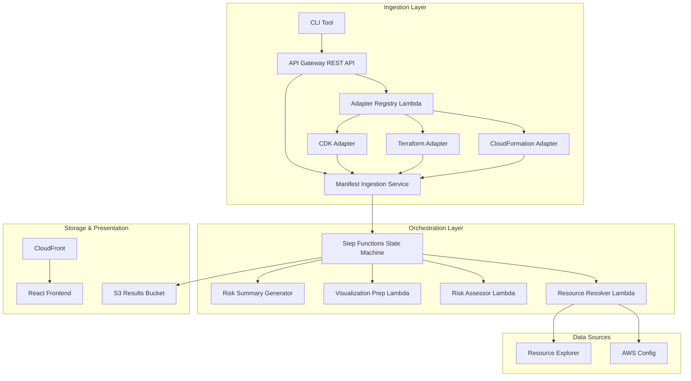

# Blast Radius Pre-Deploy Visualizer

Analyze infrastructure-as-code changesets before deployment to identify, score, and visualize downstream resource dependencies at risk. Shift the discovery of unintended impact from post-deploy incidents to pre-deploy review.

## Overview

The Blast Radius Visualizer is a serverless system that accepts changesets from any IaC tool (CloudFormation, CDK, Terraform, Pulumi), discovers downstream resource dependencies via AWS Config and Resource Explorer, computes risk scores, and presents an interactive dependency graph with filtering, export, and CI/CD integration.



## Key Features

- **IaC-tool-agnostic** — Canonical manifest format with adapter plugins for CloudFormation, Terraform, CDK, and Pulumi
- **Automated dependency discovery** — Queries AWS Config and Resource Explorer for resource relationships up to configurable depth
- **Risk scoring** — Impact scores (0-100) based on dependency depth, resource criticality, and change type severity
- **Interactive visualization** — Cytoscape.js-powered graph with zoom, pan, node selection, and risk-based color coding
- **CI/CD integration** — REST API + CLI tool with pass/fail verdicts based on configurable risk thresholds
- **Natural language summaries** — Optional Amazon Bedrock integration for plain-English risk explanations
- **Multi-tenancy** — IAM-based access scoping ensures teams only see resources they're authorized to access

## Project Structure

```
blast-radius-visualizer/
├── packages/
│   ├── core/          # Data models, validation (zod), cache, retry, verdict, auth
│   ├── lambdas/       # Lambda handlers (ingestion, adapters, resolver, assessor, etc.)
│   ├── frontend/      # React SPA with Cytoscape.js graph visualization
│   ├── cli/           # CLI tool for CI/CD pipeline integration
│   └── infra/         # AWS CDK infrastructure stack
├── package.json       # Root workspace configuration
├── tsconfig.json      # TypeScript project references
├── vitest.config.ts   # Test runner configuration
└── .eslintrc.json     # Linting rules
```

### Package Details

| Package | Description | Key Dependencies | Docs |
|---------|-------------|-----------------|------|
| `@blast-radius/core` | Shared data models, schema validation, LRU cache, retry logic, verdict evaluator, access scoping | `zod` | [README](packages/core/README.md) |
| `@blast-radius/lambdas` | 10+ Lambda handlers for the analysis pipeline | `@aws-sdk/*`, `@blast-radius/core` | [README](packages/lambdas/README.md) |
| `@blast-radius/frontend` | React SPA with interactive dependency graph | `react`, `cytoscape`, `react-router-dom` | [README](packages/frontend/README.md) |
| `@blast-radius/cli` | CLI wrapper for CI/CD integration | `@blast-radius/core` | [README](packages/cli/README.md) |
| `@blast-radius/infra` | CDK stack defining all AWS infrastructure | `aws-cdk-lib`, `constructs` | [README](packages/infra/README.md) |

## Getting Started

### Prerequisites

- Node.js 20+
- npm 9+
- AWS CDK CLI (`npm install -g aws-cdk`)
- AWS account with the following enabled (for deployment):

#### AWS Config (Required)

The Resource Resolver queries AWS Config for resource relationships. Config must be recording the resource types you want to analyze.

```bash
# Check current status
aws configservice describe-configuration-recorders

# Enable recording for all resource types
aws configservice put-configuration-recorder \
  --configuration-recorder '{"name":"default","roleARN":"arn:aws:iam::ACCOUNT_ID:role/aws-service-role/config.amazonaws.com/AWSServiceRoleForConfig","recordingGroup":{"allSupported":true,"includeGlobalResourceTypes":true}}'
```

#### AWS Config Aggregator (Required)

Advanced Queries require an aggregator, even for single-account setups.

```bash
# Check if one exists
aws configservice describe-configuration-aggregators

# Create one if empty
aws configservice put-configuration-aggregator \
  --configuration-aggregator-name blast-radius-aggregator \
  --account-aggregation-sources '[{"AccountIds":["ACCOUNT_ID"],"AllAwsRegions":true}]'
```

#### Resource Explorer (Required)

Used for cross-account and cross-region dependency discovery.

```bash
# Check status
aws resource-explorer-2 get-index

# Enable if not active
aws resource-explorer-2 create-index --type LOCAL
```

#### CDK Bootstrap (Required)

```bash
npx cdk bootstrap aws://ACCOUNT_ID/REGION
```

#### Amazon Bedrock (Optional — for AI summaries)

If you want natural language risk summaries, enable Claude 4.5 Haiku access in the Bedrock console (Settings → Model access). Check availability:

```bash
aws bedrock get-foundation-model-availability --model-id anthropic.claude-haiku-4-5-20251001-v1:0
```

The `authorizationStatus` should be `AUTHORIZED`. If not, request access in the AWS Console under Amazon Bedrock → Model access.

### Installation

```bash
git clone <repository-url>
cd BlastRadius
npm install
```

### Build

```bash
# Build all packages
npm run build

# Build a specific package
npm run build --workspace=packages/core
```

### Run Tests

```bash
# Run all tests (349 tests across 29 files)
npm test

# Run tests in watch mode
npm run test:watch

# Run tests for a specific package
npx vitest run packages/core
```

### Lint & Format

```bash
npm run lint
npm run format
npm run format:check
```

## Usage

### CLI

```bash
# Analyze a Terraform plan
blast-radius analyze --format terraform-plan --input plan.json --threshold 75

# Analyze a CloudFormation changeset from stdin
cat changeset.json | blast-radius analyze --format cloudformation --ci

# Check analysis status
blast-radius status --analysis-id <id>

# Export results
blast-radius export --analysis-id <id> --format json
```

**Exit codes:**
- `0` — Pass (no resource exceeds threshold)
- `1` — Fail (resources exceed threshold)
- `2` — Error (invalid input, timeout, or analysis failure)

### REST API

| Method | Endpoint | Description |
|--------|----------|-------------|
| POST | `/analyze` | Submit a manifest or native changeset |
| GET | `/analyze/{analysisId}` | Get analysis status and results |
| GET | `/analyze/{analysisId}/export` | Export results as JSON or PDF |
| GET | `/formats` | List supported adapter formats |

All endpoints require IAM (SigV4) authentication.

### Frontend

The React frontend is served via CloudFront and provides:
- Interactive dependency graph with zoom, pan, and node selection
- Color-coded nodes: Critical (red), High (orange), Medium (yellow), Low (green)
- Dynamic node sizing based on impact score
- Hover highlighting (dims unconnected nodes to trace paths)
- Multiple layout options (Auto, Hierarchical, Force, Circle, Grid)
- Animated edge flow showing dependency direction
- Floating legend explaining colors and sizes
- Clickable risk summary cards that filter the view
- Filter by risk category, resource type, and source IaC tool
- Sortable tabular view with expandable rows (click for full ARN + dependency chain)
- JSON and PDF export (real PDF with jsPDF)
- Real-time progress polling during analysis
- Dark/light mode toggle (persists to localStorage)

## Risk Scoring

Each affected resource receives an Impact Score (0-100):

```
Impact_Score = (depthScore × 0.30) + (criticalityScore × 0.40) + (changeTypeSeverity × 0.30)
```

| Component | Formula |
|-----------|---------|
| Depth Score | `max(10, 100 - ((depth - 1) × 10))` |
| Criticality | Critical=100, High=75, Medium=50, Low=25 |
| Change Type | Remove=100, Replace=80, Modify=50, Add=30 |

**Risk Categories:**
- Critical: 75-100
- High: 50-74
- Medium: 25-49
- Low: 0-24

## Infrastructure Deployment

```bash
# Build all packages
npm run build

# Deploy the stack
cd packages/infra
npx cdk deploy --require-approval never

# Deploy the frontend to S3
VITE_API_BASE_URL=<API_URL_FROM_OUTPUT> npm run build --workspace=packages/frontend
aws s3 sync packages/frontend/dist/ s3://<FRONTEND_BUCKET_FROM_OUTPUT>/ --delete
```

The CDK stack provisions:
- 14 Lambda functions (Node.js 20, ARM64, X-Ray tracing)
- 2 DynamoDB tables (adapter registry, analysis status)
- S3 bucket with lifecycle policies (90-day expiration)
- API Gateway REST API with SigV4 authorization (29s timeout)
- Step Functions state machine with retry policies
- CloudFront distribution for the frontend
- CloudWatch log groups (2-week retention) and alarms

**Stack Outputs after deployment:**

| Output | Description |
|--------|-------------|
| `ApiGatewayApiUrl` | REST API endpoint (SigV4 auth required) |
| `DistributionDomainName` | CloudFront URL for the frontend |
| `FrontendBucketName` | S3 bucket to upload frontend assets |
| `ResultsBucketName` | S3 bucket for analysis results |
| `StateMachineArn` | Step Functions pipeline ARN |

**Note:** The API requires SigV4 authentication. The frontend served via CloudFront cannot sign requests from the browser without an auth layer (Cognito, API keys, or a proxy). For demos, use the mock server or the CLI with AWS credentials.
- CloudWatch log groups and alarms

### Stack Configuration

```typescript
new BlastRadiusStack(app, 'BlastRadiusStack', {
  enableBedrockSummary: true,   // Enable AI-powered risk summaries
  resultsRetentionDays: 90,     // S3 lifecycle expiration
});
```

## Testing Strategy

The project uses property-based testing (fast-check) to verify 19 correctness properties alongside traditional unit tests.

**Property tests verify universal invariants:**
- Schema validation accepts all valid manifests / rejects all invalid ones
- Hierarchy flattening preserves all resources without loss or duplication
- Adapter conversion produces valid canonical manifests
- Graph traversal terminates and respects depth limits (even with cycles)
- Impact score formula correctness and monotonicity
- Score-to-category classification boundaries
- Multi-path scoring uses the maximum
- Filtering returns only matching resources
- Access scoping excludes unauthorized resources

```bash
# Run all 349 tests
npm test

# Run only property tests
npx vitest run --grep "Property"
```

## Supported IaC Formats

| Format | Input | Adapter |
|--------|-------|---------|
| CloudFormation | `DescribeChangeSet` output | Maps Action + Replacement to canonical types |
| Terraform | `terraform show -json` plan | Maps actions array, skips no-op/read |
| CDK | Cloud assembly diff | Flattens nested stacks, maps changeType |
| Canonical | Direct manifest submission | No conversion needed |

New adapters are registered in DynamoDB — no code changes to the core engine required.

## Environment Variables

| Variable | Lambda | Description |
|----------|--------|-------------|
| `ADAPTER_REGISTRY_TABLE` | Adapter Registry | DynamoDB table for adapter lookup |
| `ANALYSIS_STATUS_TABLE` | Status, Ingestion | DynamoDB table for progress tracking |
| `RESULTS_BUCKET` | Viz Prep, Failure Handler, Results | S3 bucket for analysis results |
| `ENABLE_BEDROCK_SUMMARY` | Risk Summary | Feature flag for Bedrock integration (`true`/`1`) |
| `BEDROCK_MODEL_ID` | Risk Summary | Bedrock model ID (default: Claude 3 Haiku) |
| `STATE_MACHINE_ARN` | Analyze | Step Functions state machine ARN |
| `BLAST_RADIUS_API_URL` | CLI | API endpoint URL for CLI tool |

## License

[MIT](LICENSE.md) — Copyright (c) 2025 Scott Burgholzer
